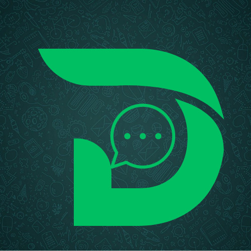

# DesireDial



DesireDial is a real-time chatting application that uses Django for the backend and React for the frontend, built as part of the DesireDial project. This application provides a seamless messaging experience with WebSocket-based communication, allowing users to chat in real-time.

## Table of Contents

- [Project Setup](#project-setup)
- [Features](#features)
- [Installation](#installation)
- [Configuration](#configuration)
- [Usage](#usage)
- [Screenshots](#screenshots)
- [Technologies Used](#technologies-used)
- [Folder Structure](#folder-structure)
- [Future Enhancements](#future-enhancements)
- [Contributing](#contributing)
- [License](#license)

## Project Setup

The DesireDial project consists of:

- **Backend (Django)** - Manages authentication, WebSocket communication, and database management.
- **Frontend (React)** - Provides a user interface for chat rooms, messaging, and user settings.

The React project is named **Desire**, while the Django project is named **Dail**.

## Features

- **Real-Time Messaging**: Users can send and receive messages instantly.
- **User  Authentication**: Secure user login and registration.
- **Chatrooms**: Allows users to create and join chat rooms.
- **Notifications**: Notifies users of incoming messages in real time.
- **User  Profiles**: Customizable profiles for each user.
- **Responsive Design**: Compatible with both mobile and desktop screens.

## Installation

### Prerequisites

Ensure you have the following installed:

- Python 3.x
- Node.js & npm
- Django
- Vite

### Backend (Django)

1. Clone the repository:

   ```bash
   git clone https://github.com/yourusername/DesireDial.git
   cd DesireDial/Dail
   ```
2. Install dependencies:

    ```bash
    pip install -r requirements.txt

    Run migrations:
    python manage.py migrate
    ```

3. Start the Django development server:
    ```bash
    python manage.py runserver
    Frontend (React)
    ```
4. Navigate to the frontend directory:

    ``` bash

    cd ../Desire
    ```


5. Install dependencies:

  ```   bash

    npm install
   ```
    ```
6. Start the development server:
   ``` bash
   npm run dev
   ```

7. Configuration
WebSocket Configuration

Ensure you have set up the WebSocket configurations for Django Channels to enable real-time messaging. Update your routing.py file located in the chats folder to contain paths for chatroom and notifications.
Environment Variables

Create a .env file in the Django project root and add the following variables:
``` bash
   
   SECRET_KEY=your_secret_key
   DEBUG=True
   ALLOWED_HOSTS=localhost,127.0.0.1
   DATABASE_URL=sqlite:///db.sqlite3  # or your desired database URL
```


In the React project, create a .env file and add the following:
```bash

VITE_API_URL=http://127.0.0.1:8000
```

Usage

Start the Django backend server:
``` bash

python manage.py runserver
```

Start the React frontend server:

``` bash

npm run dev
```

Open a browser and go to http://localhost:3000 to access the application.

Register a new account or log in to start chatting!


    Backend: Django, Django REST Framework, Django Channels
    Frontend: React, Vite, CSS
    Real-Time Communication: WebSockets
    Database: SQLite (development) / PostgreSQL (production)

# Folder Structure
```

DesireDial/
├── Dail/                  
│   ├── chats/            
│   ├── users/            
│   ├── Dail/              
│   ├── requirements.txt 
│   └── manage.py
└── Desire/             
    ├── src/               
    ├── public/         
    ├── package.json      
    └── vite.config.js
```
# Future Enhancements

    Media Sharing: Allow users to share images and files in chats.
    Message Search: Implement a search feature within chat rooms.
    Group Chats: Add functionality for group conversations.
    Message Reactions: Enable users to react to messages.
    Enhanced Notifications: Real-time push notifications for mobile users.

# Contributing

We welcome contributions! Please fork the repository, create a new branch, and submit a pull request with your updates. Ensure your code follows the project’s coding standards and is thoroughly tested.
License

Distributed under the MIT License. See LICENSE for more information.
